## Telematic Applications

# TCP Exercises

*Academic year 2024-2025*  
*Daniel Díaz Sánchez*

---

## 1. Basic Problems

### Basic Problem 1
Let the TCP connection configured with a MTU = 1320 Bytes, running over a 20Mbps link with a
propagation time of 5ms. Calculate the RTT (Round Trip Time).

> **Answer** ($✓$)
>
> First, we'll find the transmission time for the biggest segment possible, $T_{txSEG}$. This is a
> transmission of maximum size, so its size (including headers) is the MTU: $1320$ bytes
>
> $$
> T_{tx} = \frac{S_{tx}}{R_{tx}} = \frac{1320 · 8}{20 · 10^6} = 528 \text{ μs}
> $$
>
> Then, we'll find the transmission time for an ACK segment, $T_{txACK}$. This only includes the IP
> and TCP headers, so its size is $40$ bytes
>
> $$
> T_{txACK} = \frac{S_{tx}}{R_{tx}} = \frac{40 · 8}{20 · 10^6} = 16 \text{ μs}
> $$
>
> With this, the RTT is:
>
> $$
> RTT = T_{txSEG} + T_{txACK} + 2T_{prop} = 0.528 + 0.016 + 2 · 5 = 10.544 \text{ ms}
> $$

### Basic Problem 2
Unless instructed otherwise in the problem you can assume that **every segment is individually
acknowledged** (simplifies calculations) and that **the sender always sends data if there are data
to be sent** (whenever there is enough window and data pending to be sent). Reason about differences
in cases when you assume this and when not.

> **Answer**
>
> The first assumption implies that delayed acknowledgements are not being used. This option can be
> turned off in some cases. The second assumption implies that Nagle's Algorithm is not being used
> either.

### Basic Problem 3
If the sender sends the whole window during an RTT, how much will the window grow depending on the
TCP mode (slow start or congestion avoidance)? How can it be simplified (provide a simplification
for congestion avoidance)?

> **Answer**
>
> In slow start mode, if the sender sends the whole window during an RTT, when it gets back all of
> the acknowledgements, the congestion window `cwnd` will grow as much as the size of that window.
> If the effective window was limited by the congestion window, it will grow to twice its original
> size: `cwnd = 2*cwnd`. If it was limited by the receiver window instead, the congestion window
> will grow to the combined size of the original congestion window plus the receiver window:
> `cwnd = cwnd + rwnd`.
>
> In congestion avoidance, for each acknowledgement received, the congestion window will grow by a
> fraction of the MSS equivalent to $\frac{1}{\text{cwnd}} \cdot MSS$. When it gets all
> acknowledgements for the whole window, if the effective window was limited by the congestion
> window, then the congestion window will have grown by 1 MSS. However, if the effective window was
> limited by the receiver window, then the congestion window will have grown by
> $\frac{\text{rwnd}}{\text{cwnd}}$.

## 2. Problems

### Problem 4
In a TCP connection, after exchanging several segments, we have an effective window of 16 segments
$V_{ef} = 16$. The slow start threshold has the default TCP value (65535). If $MSS = 1024 \text{
bytes}$ and the advertised window in both cases is $WIN = 200$ segments. Answer the following:

#### Question 4.a
What is the MTU provided by the link layer?

> **Answer**
>
> Assuming that the MSS has been correctly adjusted to the link layer's MTU, its value must have
> been set so that a segment with that amount of data can fit perfectly in the mtu. This means
>
> $$
> MTU = MSS + S_{hIP} + S_{hTCP}
> $$
>
> Where $S_{hIP}$ and $S_{hTCP}$ are the IP and TCP header sizes, respectively. Both have a value of
> 20 bytes. So finding the MSS is a simple matter of addition.
>
> $$
> MTU = 1024 \text{ B} + 20 \text{ B} + 20 \text{ B} = 1064 \text{ bytes}
> $$

#### Question 4.b
What is the value of $cwnd$?

> **Answer**
>
> Since the effective window $V_{ef} = \min (cwnd, WIN) = 16 \text{ segments}$ is smaller than the
> advertised window $WIN = 200 \text{ segments}$, we can assume that it's being limited by the
> congestion window. Therefore, $cwnd = 16 \text{ segments}$.

#### Question 4.c
How long would it take for the congestion window ($cwnd$) to reach 120 segments?

> **Answer**
>
> The value of the slow start threshold in segments is $\frac{65535}{1024} \text{segments} ≈ 64 \text{
> segments}$. This means, from that point on, the congestion window will grow in congestion avoidance
> mode.
>
> First, let's find how long it would take to get to that point in the current mode, which is slow
> start. Assuming the propagation time is much greater than the transmission time, we can simplify
> calculations and say that the congestion window grows to twice its size every RTT.
> $$
> cwnd_{final} = cwnd_{initial} \cdot 2^{\frac{t_{final}-t_{initial}}{RTT}}
> $$
>
> Let $t_0$ be the starting moment and $cwnd_0$ be the initial congestion window size. Then, the time
> it would take for $cwnd$ to reach $ssthresh$ is given by
>
> $$
> \begin{aligned}
>     t_{ssthresh} - t_0 &= RTT \cdot \log_2 \frac{ssthresh}{cwnd_0} \\
>     &= RTT \cdot \log_2 \frac{64}{16} \\
>     &= 2 RTT
> \end{aligned}
> $$
>
> From this point on, the congestion window grows linearly, meaning approximately every RTT it will
> grow by 1 MSS. Its growth is given by the following equation:
>
> $$
> cwnd_{final} = cwnd_{initial} + \frac{t_{final}-t_{initial}}{RTT} \text{ MSS}
> $$
>
> Now, to get from this point to the desired value, the time it would take is given by
>
> $$
> \begin{aligned}
>     t_{120 \text{ seg}} - t_{ssthresh}
>     &= RTT \cdot \frac{(cwnd_{120} - cwnd_{ssthresh})}{\text{MSS}} \\
>     &= (120-64) RTT \\
>     &= 56 RTT
> \end{aligned}
> $$
>
> And the total time elapsed to get to the point where $cwnd$ is 120 segments would be the sum of both:
>
> $$
> \begin{aligned}
>     t_{120 \text{ seg}} - t_0 &= t_{120 \text{ seg}} - t_{ssthresh} + t_{ssthresh} - t_0  \\
>     &= 2 RTT + 56 RTT \\
>     &= \boxed{58 RTT}
> \end{aligned}
> $$

#### Question 4.d
How many ACKs would need to be received to reach that window of 120?

> **Answer**
>
> We'll use the results from the previous question to get this result.
>
> During slow start, each ACK increases `cwnd` by 1MSS. Therefore, the number of ACKs $N$ required to
> increase the congestion window from its initial value of $cwnd_0 = 16 \text{ MSS}$ to the
> slow start threshold value $ssthresh = 64 \text{ MSS}$ can be found solving the following equation
>
> $$
> \begin{aligned}
> cwnd_{final} = cwnd_{initial} + N \text{ MSS} ⇒ \\
> N_{initial \to final} = \frac{cwnd_{final} - cwnd_{initial}}{\text{MSS}}
> \end{aligned}
> $$
>
> $$
> N_{0 \to ssthresh} = \frac{cwnd_{ssthresh} - cwnd_0}{\text{MSS}} = 64-16 = 48
> $$
>
> During congestion avoidance, however, the number of acks needed to increase the congestion window by
> one MSS is equal to the congestion window, since
>
> $$
> \text{On ACK: } cwnd \to cwnd + \frac{1}{cwnd}
> $$
>
> For two acks, this becomes
>
> $$
> cwnd \to cwnd + \frac{1}{cwnd} \to cwnd + \frac{1}{cwnd} + \frac{1}{cwnd + \frac{1}{cwnd}}
> $$
>
> However, since $cwnd \gg \frac{1}{cwnd}$, we will simplify this into
>
> $$
> cwnd \to cwnd + \frac{1}{cwnd} \to cwnd + \frac{2}{cwnd}
> $$
>
> We will only take into account the updated $cwnd$ every RTT. For one RTT, where the whole $cwnd$ is
> sent and then all ACKs are received, this would look like
>
> $$
> cwnd \to \dots \to cwnd + \frac{cwnd}{cwnd} = cwnd + 1
> $$
>
> Then, for the next round the growth could be expressed as follows
>
> $$
> cwnd \to cwnd + \frac{cwnd}{cwnd} = cwnd + 1 \to cwnd + 1 + \frac{cwnd+1}{cwnd+1} = cwnd + 2
> $$
>
> Note that for the first round, $cwnd$ ACKs were received, while for the second round $(cwnd + 1)$
> ACKs were received. Therefore, in order to have $cwnd$ grow by $n \text{ MSS}$, the required amount
> of ACKs can be approximated the following way
>
> $$
> \begin{aligned}
>     N_{cwnd_x \to cwnd_{x+n}}
>     &= \overbrace{cwnd_x}^\text{round 1} + \overbrace{cwnd_x + 1}^\text{round 2} + \dots
>        + \overbrace{cwnd_x + n-1}^\text{round n} \\
>     &= n \cdot cwnd_x + \sum_{i=0}^{n-1} i \\
>     &= n \cdot cwnd_x + \frac{n \cdot (n-1)}{2}
> \end{aligned}
> $$
>
> With this, we can find the amound of ACKs needed to increase our $cwnd$ from $ssthresh$ size to 120
> MSS. The amount of "rounds" is equal to $cwnd_{120} - cwnd_{ssthresh} = 120-64 = 56$. Therefore
>
> $$
> \begin{aligned}
>     N_{ssthresh \to 120} &= 56 \cdot cwnd_{ssthresh} + \frac{56 \cdot (56-1)}{2} \\
>     &= 5124
> \end{aligned}
> $$
>
> Finally, as before, the total number of acks is the sum of both:
>
> $$
> \begin{aligned}
>     N_{initial \to 120} &= N_{intial \to ssthresh} + N_{ssthresh \to 120} \\
>     &= 48 + 5124 \\
>     &= \boxed{5172}
> \end{aligned}
> $$

### Problem 5
Hosts A and B establish a TCP connection. They both announced $WIN = 4 \text{ KB}$ and $MSS = 256
\text{ B}$ in their respective SYN segments.

#### Question 5.a
How was the connection affected by a timeout event of the first segment?

#### Question 5.b
Fill in the following table with the corresponding values of the variables: data sent, cwnd and
ssthresh. Indicate which algorithm was applied by TCP in each case.

<!-- In case of the table being automatically formatted, use this line to span all columns
|                             TIMEOUT                              |||||
-->

|  Data   | Sender Segment | Receiver ACK | Algorithm and cwnd | ssthresh |
| :-----: | :------------: | :----------: | :----------------: | :------: |
|         |      SYN       |              |       `___`        |  `___`   |
|                                TIMEOUT                              |||||
|         |      SYN       |              |                    |          |
|         |                |    SYNAC     |       `___`        |  `___`   |
|         |      ACK       |              |                    |          |
|    D    |     `___`      |              |                    |          |
|         |                |   ACK 257    |       `___`        |  `___`   |
|    D    |     `___`      |              |                    |          |
|    D    |     `___`      |              |                    |          |
|         |                |   ACK 513    |       `___`        |  `___`   |
|    D    |     `___`      |              |                    |          |
|    D    |     `___`      |              |                    |          |
|         |                |   ACK 769    |       `___`        |  `___`   |
|    D    |     `___`      |              |                    |          |
|         |                |   ACK 1025   |       `___`        |  `___`   |
|    D    |     `___`      |              |                    |          |
|         |                |   ACK 1281   |       `___`        |  `___`   |

Figure 1: Table for problem 5 part b

#### Question 5.c
The connection of the previous example remained active and it reached a situation where the last ACK
received was waiting for data byte 6401, being the cwnd=2426 bytes and ssthresh=512 bytes. Fill in
the following table with data of the cwnd and ssthresh and indicate the algorithms used by the
sender.

| Data | Sender Segment | Receiver ACK | Algorithm and cwnd | ssthresh |
| :--: | :------------: | :----------: | :----------------: | :------: |
|      |                |   ACK 6401   |                    |          |
|      |                |   ACK 6657   |        2426        |   512    |
|  D   |   8705:8960    |              |                    |          |
|      |                |   ACK 6657   |       `___`        |  `___`   |
|      |                |   ACK 6657   |       `___`        |  `___`   |
|      |                |   ACK 6657   |       `___`        |  `___`   |
|  D   |   6657:6912    |              |                    |          |
|      |                |   ACK 6657   |       `___`        |  `___`   |
|      |                |   ACK 6657   |       `___`        |  `___`   |
|      |                |   ACK 6657   |       `___`        |  `___`   |
|  D   |   8961:9216    |              |                    |          |
|      |                |   ACK 6657   |       `___`        |  `___`   |
|  D   |   9217:9472    |              |                    |          |
|      |                |   ACK 6657   |       `___`        |  `___`   |
|  D   |   9473:9728    |              |                    |          |
|      |                |   ACK 8961   |       `___`        |  `___`   |

Figure 2: Table for problem 5 part c

### Problem 6

A company’s backup system over TCP follows this protocol:

```txt
C > S: header (40 Bytes)
S > C: header (40 Bytes)
S > C: path and name of the file in the server (les or equal to 1024 Bytes)
C > S: data
S > C: md5sum(data)
```

The backup is carried over a full duplex of 56kbps with MTU=700 bytes (at IP level)
and 50 ms propagation delay, the server announces a win=32KB and the length of
the backup archive sent by the client is 10MB. Answer the following questions:

#### Question 6.a
Draw the timing diagram of the whole connection. regarding data transmission,
limit the diagram data exchange to the first 8 segments and the last one.

#### Question 6.b
From the point where the client starts sending backup data, how many server
ACKs have to be received to be able to send the two first data segments?

#### Question 6.c
What is the maximum value of the effective window reached at the client? How
many ACKs have to be received since the client started sending data?

#### Question 6.d
If after the first segments the line experiments a 100ms problem affecting only the
traffic client to server. When will happen the retransmission of the lost segment?
What would be the value of the cwnd when the acknowledgemnt to that segment
is received? How many ACKs would be needed to reach the maximum effective
value of the sender window? Illustrate your answer with a timing diagram.

#### Question 6.e
If the link is done as indicated in the figure,


<p class="caption">
Figura 3: Table for problem 6 part e
</p>

How would this affect the cwnd? what buffer size would be needed at the router
to allow the continuous sending in the client backup?

### Problem 7
A company with five regional offices uses a TCP application to backup and send data to its Data
Center (DC). The backup application is run every night in the regional offices and in the DC. The
application is run in the DC as a server with the TCP socket configured to initially offer a window
of 10MB. The protocol of the backup application consists of the client sending the data, and once it
is finished, the server sends the md5 sum of the received data in return. Every office has a PPP
link (1Gbps, MTU of 1500B, and propagation delay of 2ms). Night traffic in the PPP links is only due
to the backup application. The servers running the backup application (both in the regional offices
and in the DC) are connected to their respective routers at 2Gbps.

#### Case 7.a
If only one regional office is active (i.e. only one sending backup data):

1. What window size value ($W_e$) allows continuous sending in the PPP link?
2. If $W_e$ is reached by the sender and a timeout occurs, how much time is required to reach $W_e$
   again?

#### Case 7.b
If all the offices are active (i.e. sending traffic) to the DC server:

1. Can they reach the value We as computed in previous questions?
2. Is the link to the server of the DC fairly shared?
3. Tuning any TCP parameter can provide a better performance? Explain your answer.

## 3. Advanced problems

### Advanced Problem 8
An online gaming company is willing to release its latest game called “cephalopods
game” in Spain that will work over TCP. The game requires large networking resources so the company is making a profile of the average connection in Spain to test
if the game can be correctly played by average internet users. The average network
model of Spanish clients is shown in figure 4 (for any question, you can suppose WIN
does not limit and that sstrhesh is 65535 bytes).

```mermaid
%%{init: {'forceLegacyMathML': true}}%%
graph LR
client(["🖥️ <br/>Client"])
server(["🖥 <br />Server"])
router(("R <br />MTU=1500"))
client <-- "tₚ=1μs <br/> 1gbps" --> router
router <-- "tₚ=40μs <br/> 600 mbps" --> server
```



<p class="caption">
Figura 4: Average connection
</p>

#### Question 8.a
Calculate the window that allows for continuous sending

#### Question 8.b
Calculate the exact (bandwidth at application level (in Mbps) once the continuous sending window has
been reached. Can be the game played considering it requires more than 500Mbps at application level?

#### Question 8.c
How long would it take (in both RTTs and seconds) to reach the continuous sending window since the
beginning of the connection? Indicate always the algorithm used to calculate the window and the
value of cwnd at any time, especially when the algorithm changes

### Advanced Problem 9
(Continues the previous problem points)  
The developers of the game consider the time it takes to reach the window is very long and can be
frustrating to the most impatient players. So, they decide to play a video whereas the client
downloads updates, new content and new multimedia from the server to improve the game. In this way
the game gets updated whereas the window increases to the appropriate value and the player is happy
watching game related videos. To achieve this, they propose two different protocols at application
level.

**Protocol A**: the client uses the `Sol(N)` message to request $N$ segments to be sent by
the server while the `Sol(N)` confirms the reception of the previous $N − 1$ segments.
The server does not send any segment until the `Sol(N)` message is received; the client
does not send `Sol(N)` until $N − 1$ previous segments are received. Since the purpose
is to increase the window, $N$ will be always the effective window value. Fig 5 shows
the protocol for `cwnd>sstresh`.


<p class="caption">
Figure 5: Prococol A
</p>

**Protocol B**: the client uses the `Sol(N)` message to confirm the reception of the $N −1$ previous
segments. The server can always send if there is available window it does not need to wait for the
next `Sol` message, but the client does not send `Sol(N)` until $N −1$ previous segments are
received. Since the purpose is to increase the window, N will be always the effective window value.
Fig 6 shows the protocol for `cwnd>sstresh`.


<p class="caption">
Figura 6: Prococol B
</p>

#### Question 9.a
The developers perform some tests and discover that several Internet providers have a defect that
the last segment sent by the server get lost when the effective window is exactly 1024. Considering
that defect, how long (in RTT) will it take to reach the continuous sending window from the
beginning in the case of the protocol A? (calculate the cwnd and indicate the algorithm at any
change)

#### Question 9.b
Considering the same defect as in the previous question, how long (in RTT) will it take to reach the
continuous sending window from the beginning in the case of the protocol B? (calculate the cwnd and
indicate the algorithm at any change)

### Advanced Problem 10
You have been asked to advise a group of scientists on the data link between a rover and a base
station for a Mars mission.

Several scenarios are considered to determine the best solution. The application at the rover
(`app 1`) works in periods in which it performs the following: collects data, opens a connection,
sends a data set, closes the connection, and starts again.

Scenario one There is a single rover that collects samples and sends data. The antenna is
omidirectional, so it can receive data regardless of the location of the rover. The MTU is 1040
Bytes

```mermaid
graph LR
    base(("📡"))
    rover(("🛰️"))
    rcv1["Receiver 1"]
    tx1["Transmitter 1"]
    r1(("R"))
    r2(("R"))

    %% nothing1((" ")) ~~~ base; rover ~~~ nothing2((" "))
    rcv1 ~~~ base; rover ~~~ tx1
    base <------> rover
    rcv1 <--> r1 <------> r2 <--> tx1
```



<p class="caption">
Figura 7: scenario 1 problem 10
</p>

#### Question 10.a
Considering the $sstresh = 63000$ Bytes and that $WIN = 64$ segments, if the rover sends a data set
of 1MB at a time,

1. How many RTTs will it take to send it?
2. The scientific team tested the application under Martian conditions and it did not work. Not
   finding the problem, they consult you stating that the link between the base station and the
   rover is 1Mbps and the propagation time is 5ms.
3. How long, **in RTTs**, does the rover take to send the data set in this case?

#### Question 10.b
After making some changes to the link, the scientific team gets the application to work. After the
change, the application can send, at most, using the link the best it cans, 64 segments each RTT
($V_{cs}$). As an additional design decision, they force the sender (rover) and receiver (base
station) to use an announced window of 64.

They also add a monitoring application to the rover that sends 6 segments every
RTT with the status of the hardware.

```mermaid
graph LR
    base(("📡"))
    rover(("🛰️"))
    rcv1["Receiver 1"]
    rcv2["Receiver 2"]
    tx1["Transmitter 1"]
    tx2["Transmitter 2"]
    r1(("R"))
    r2(("R"))

    %% nothing1((" ")) ~~~ base; rover ~~~ nothing2((" "))
    rcv1 ~~~ base; rover ~~~ tx1
    base <-- "x Mbps, 5ms" ------> rover
    rcv1 & rcv2 <--> r1 <-- "x Mbps, 5ms" ------> r2 <--> tx1 & tx2
```



<p class="caption">
Figura 8: Scenario 1 - 3)
</p>

1. What changes has the scientific team made to the link to allow sending that number of segments
   each RTT? Calculate the new link settings. You can discard the transmission time of the ACK.

2. The application (`app_1`) begins sending data continuously **until the congestion window reaches
   8**. Then, it sends the corresponding 8 segments, but, **after sending the 8 segments, it waits
   until the transmission and acknowledgment of all segments is completed before continuing to send
   data**. Unfortunately, the new application (`app_2`) affects the first one (`app_1`) in such a
   way that segment $D_9$ is lost. Use as many rows as needed from the following tables (as seen
   from the rover sending the data), filling in all fields to indicate what happens (alg must
   clearly contain the algorithm used at each moment - if there are changes - and the calculation).
   In the column segment, indicate the name, Dn for data, ACKn for ACKs. If the segment is received,
   put an X in the Rx column, if it is sent, in the Tx column. Reflect in cwnd the value of the
   congestion window, in Vef the value of the effective window, and in Vefu the usable window
   (considering the pending ACK segments). sst is used for the slow start threshold.

| Segmento | Rx  | Tx  | cwnd | $V_{ef}$ | $V_{ef}u$ | sst | alg |
| :------: | :-: | :-: | :--: | :------: | :-------: | :-: | :-: |
|          |     |     |      |          |           |     |     |
|          |     |     |      |          |           |     |     |
|          |     |     |      |          |           |     |     |
|          |     |     |      |          |           |     |     |
|          |     |     |      |          |           |     |     |
|          |     |     |      |          |           |     |     |
|          |     |     |      |          |           |     |     |
|          |     |     |      |          |           |     |     |

**Scenario two** There is more than one rover. All vehicles collect samples and send data. The
antenna is directional and rotates, so it can only receive data when the rover is aligned with it.
Only one rover transmits at a time. The MTU is 1040Bytes.

In this scenario, each rover sends a data set including images, which occupies a total of 20MBytes.
There is no limitation on flow control. The ssthresh parameter has a value of 63.

Since the antenna rotates, each rover has a limited time to transmit all the information. The
scientific team is trying to figure out how much time each rover needs to transmit all the data to
determine the rotation speed.


Figure 9: Scenario 2 problem 10

#### Question 10.c
How many RTTs will the vehicle need to transmit the complete data set in this scenario (20 MB)?

```txt
—- Drawing for the solution —-
segments  <----63-----> <----------------19937------------------>
cwnd      1...    ...64   65     66   ..     ..  (an -2)  (an-1)
cwnd      1...    ...64 (64+1) (64+2) ..     ...(64+n-2) (64+n-1)
succesion                  1      2                n-2      n-1
alg       <--s.start--> <---  congestion avoidance ------------->
```

It might be helpful to consider the following questions: How many segments will need to be
transmitted in total? How many RTTs will it take for cwnd to reach the value of 63? After that, how
many RTTs will it take to transmit the remaining segments?

Based on the window size, which algorithm will be used, and how will the window grow each RTT?

It may also be useful to know

1. The sum of monotonic sequences $(a_0 + a_1+ \dots +a_n)$ where $a_1 = a_0 + 1, a_2 = a_1 + 1,
   \dots$, can be calculated as $S = \frac{n·(a_0 + a_n)}{2}$
2. The solution to a quadratic equation $ax^2 + bx + c = 0$ is $x = \frac{-b±\sqrt{b^2 - 4ac}}{2a}$
