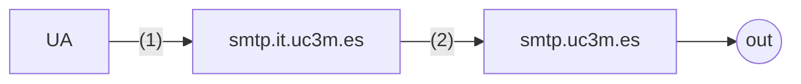

## Telematic Applications

# DNS Problems

*Academic year 2024-2025*  
*Prof: Daniel Díaz Sánchez*

---

## Problem 1

A person with the email `usuario@it.uc3m.es` composes an email using his User
Agent (UA) on a PC called `pc.it.uc3m.es.` The email is addressed to several
people as seen in the To field: `personal@it.uc3m.es` and `jose@it.uc3m.es`
(colleagues from the department), `directorEPS@uc3m.es` (the school director),
and `out@otherdomain.org` (someone external). The email to be sent is the
following:

```eml
Date: Wed, 16 Dec 2015 10:00:00 +0200
From: Sender <usuario@it.uc3m.es>
To: personal@it.uc3m.es,jose@it.uc3m.es,directorEPS@uc3m.es,out@otherdomain.org
Subject: My best wishes
X-Mailer: MyXmasPersonalSpammer

Merry Christmas and a prosperous 2016!
```

### Question 1.a)
Notice that the email contains non-NVT ASCII characters in the body (¡, ó, and
ñ). How big would be the message (in bytes) in Quoted Printable and base64? If
encoding the message is necessary, should other headers be added? If so,
indicate which one(s) and why.

## Problem 2
Again, we consider the previous problem where a person with the email
`usuario@it.uc3m.es` composes an email using their User Agent (UA) on a PC
called `pc.it.uc3m.es.` The email is addressed to several people as seen in the
To field: `personal@it.uc3m.es` and `jose@it.uc3m.es` (colleagues from the
department), `directorEPS@uc3m.es` (the school director), and
`out@otherdomain.org` (someone external). The figure shows a scenario where the
email servers within UC3M are displayed and the path followed by the email. The
server `smtp.it.uc3m.es` is the server that accepts mail for the domain
`it.uc3m.es,` and the server `smtp.uc3m.es` is the server that accepts mail for
the domain `uc3m.es`.



Figura 1: SMTP servers

### Question 2.a)
Write the SMTP exchange at point 1 (between `pc.it.uc3m.es` and
`smtp.it.uc3m.es`) for sending the email.

### Question 2.b)
Indicate and explain, with as much precision as possible, the differences
between the exchange at point 1 and the one at the exit of `smtp.uc3m.es` (do
not write the trace, just comment on the differences).

## Problem 3
The following email scenario is presented in Figure 2. In this architecture, the
following is shown:

Figura 2: Email P3

* There is a machine running the email User Agent (UA) called `pc.it.uc3m.es.`
  This machine is located in the domain `it.uc3m.es`. The default outgoing MTA
  configured on all machines in the `it.uc3m.es` domain is `smtp.it.uc3m.es`. An
  authorized DNS server for the `it.uc3m.es` domain is `dns.it.uc3m.es`.
* All outgoing email from the `uc3m.es` domain is sent via the MTA
  `smtp.it.uc3m.es`. The DNS server for the `uc3m.es` domain is `dns.uc3m.es`.

* The domain `uam.es` has `smtp.uam.es` as its incoming MTA. An authorized DNS
  server for that domain is `dns.uam.es`.
* The domain `upm.es` has smtp.upm.es as its incoming MTA. The server
  `smtp.upm.es` also has an IMAP server that allows users to access their
  mailboxes. An authorized DNS server for that domain is dns.upm.es. The email
  client (UA) for the user with the email address `dpo@upm.es` is on the machine
  `pc.upm.es`.

The user interface view of the UA on `pc.it.uc3m.es` is shown in Figure ??. It
shows the email being

### Question 3.a)
Regarding the transport of the email. Provide the **complete SMTP trace**
(including the commands and their parameters sent by the client and the server’s
responses) as it would be sent at point 1 in Figure 2. Use `<mail>` to indicate
where the email would go.

### Question 3..b)
Describe in detail the differences in the complete SMTP traces between points 1
and 4 of Figure 2 as well as the differences in the RFC822 format of the email
that may have been affected by the transit through the MTAs.

### Question 3.c)
Regarding the format of the email. Write the necessary and sufficient headers in
RFC822 format (**indicate their purpose**) and describe how the body of the
message (including headers or separators) is organized with respect to the email
received by `dpo@upm.es.` Keep in mind that the order of the email parts is
indifferent, and the appropriate character set for encoding the text would be
ISO8859-1. Refer to the headers in the image ??. You can use `<content-text>`
and `<content-file>` to represent the parts without needing to copy their
content.

### Section 3.d)
Regarding the email architecture represented in Figure 2. Suppose that, apart
from the email sent in the previous questions, an email is sent from the domain
`uam.es` (with the origin address `otri@uam.es`) to `boss@it.uc3m.es`:

#### Question 3.d.I)
The Universidad Carlos III has an antispam and antivirus system on the MTA
`smtp.uc3m.es`. This information is not known by entities external to `uc3m.es`.
Discuss what would need to be done so that any email destined for an address in
the `it.uc3m.es` domain, i.e., `*@it.uc3m.es`, is mandatorily routed through
`smtp.uc3m.es` without being sent directly to `smtp.it.uc3m.es`.

#### Question 3.d.ii)
How could it be ensured that internally, once the email is received by
`smtp.uc3m.es`, it is correctly orwarded to the MTA `smtp.it.uc3m.es`?
