## Telematic Applications <!-- omit in toc -->

# HTTP Problems

*Academic year 2024-2025*

---

### Table of Contents

* [Problem 1](#problem-1)
    * [Section 1.a)](#section-1a)
* [Problem 2](#problem-2)
    * [Section 2.a) ✓](#section-2a-)
    * [Section 2.b) ✓](#section-2b-)
    * [Section 2.c) ✓](#section-2c-)
    * [Section 2.d) ✓](#section-2d-)
    * [Section 2.e) ✓](#section-2e-)

---

## Problem 1

The content of an HTML file named index.html is shown below. The page is
accessible at the URL `http://www.test.com/index.html`.

```html
<html>
  <body>
    <p>This is a great web page</p>
    
  </body>
</html>
```

### Section 1.a)

If the user enters the URL `http://www.test.com/index.html` in their browser
using HTTP 1.1,

#### Question 1.a.I)
How many connections will be opened? And in HTTP 1.0?

> **Answer** (class notes)
>
> In HTTP 1.1, only one connection is opened.
>
> In HTTP 1.0, two connections are opened: one for HTML and one for PTC

#### Question 1.a.II) ✓
Write the requests that are made assuming the use of HTTP 1.1.

> **Answer** (class notes)
>
> First, the connection must be opened using the preferred method. Then, the
> sequence of requests and responses is the following:
>
> 1. Request:
>
>     ```http
>     GET /index.html HTTP/1.1
>     Host: www.test.com
>     ```
>
>     Response:
>
>     ```http
>     HTTP/1.1 200 OK
>     Date: ...
>     Content-Length: ...
>     Content-Type: ...
>     ```
>
> 2. Request:
>
>     ```http
>     GET /res/aptel.png HTTP/1.1
>     Host: www.test.com
>     ```

#### Question 1.a.III) ✓
If the web server hosted another virtual host, for example, `www.example.com`,
how would the server know which virtual host the requests are intended for?

> **Answer** (class notes)
>
> By means of the `Host` header in the requests

#### Question 1.a.IV) ✓
The website owner wants to offer a premium service for fast image uploads.
Engineers have adjusted the TCP window size depending on whether the user is
premium or regular. If the HTML page (including HTTP response headers) occupies
one segment, and the image 271 segments (including HTTP headers), knowing that
`ssthresh=48`, how many RTTs would it take to send the image for a premium user
(`WIN=32`) and for a regular user (`WIN=16`)?

> **Answer** (class notes)
>
> Since `ssthresh` is larger than either `WIN`, it will not matter in this
> problem. The TCP congestion control will start in *slow start* mode, but after
> `cwnd` crosses `WIN`, we won't care about its value because the effective window
> will be limited by `WIN`.
>
> ##### 1.a.IV.a) Premium users
>
> In the premium user's case, the client's effective window will grow in the
> following manner, assuming updates happen approximately every RTT:
>
> $$
> V_{ef} = 1, 2, 4, 8, 16, 32, 32, 32, \dots
> $$
>
> Every RTT, $V_{ef}$ segments are sent. So, in order to transmit the full 272
> segments of data (webpage and image), we can find the number of RTTs required
> using the following procedure:
>
> * $1.5$ RTTs to establish the connection
> * $1+2+4+8 + 16 = 31$ segments sent in $5$ RTTs
> * $272-31$ segments sent in $\frac{272-31}{32} ≈ 8$ RTTs
>
> Total for premium users: $\boxed{14.5 \text{ RTTs}}$
>
> ##### 1.a.IV.b) Non-premium users
>
> In the non-premium user's case, the client's effective window will grow in the
> following manner, assuming updates happen approximately every RTT:
>
> $$
> V_{ef} = 1, 2, 4, 8, 16, 16, 16, 16, \dots
> $$
>
> Every RTT, $V_{ef}$ segments are sent. So, in order to transmit the full 272
> segments of data (webpage and image), we can find the number of RTTs required
> using the following procedure:
>
> * $1.5$ RTTs to establish the connection
> * $1+2+4+8 = 15$ segments sent in $4$ RTTs
> * $272-15$ segments sent in $\frac{272-15}{16} ≈ 17$ RTTs
>
> Total for non-premium users: $\boxed{22.5 \text{ RTTs}}$

## Problem 2

The figure 1 shows a network diagram in which a server supporting HTTP/1.1 and
HTTP/2 provides a streaming application. Available resources for every phase of
the streaming application are also shown and will be described later. The way we
use (**phases**) the streaming web is the following:

* **Access**: The user downloads the main web page `index.html` and all its
  components and shows it.

* **Configuration**: The user configures the video he wants to stream and
  authenticates by sending data (using JSON format with mime type  
  application/json). For example, suppose he selects the video with identifier
  123, using audio and subtitles in Spanish (from Spain) (suppose this piece of
  data always occupies 88 bytes) and has the following structure:

    ```json
    {"user":"usuario","password":"password",
    "videoid":"123","audio":"ES-ES","subs":"ES-ES"}
    ```

* **Play**: The user makes a request to the already configured streaming
  resources to start the video play.

```mermaid
flowchart LR
    PC["💻"] -->|Request| Server[️www&ZeroWidthSpace;.video.org]

    subgraph Access ["Acceso"]
    direction LR
        pic1["pic1.jpg (12KByte)"]
        pic2["pic2.jpg (8KByte)"]
        index["Index.html (1KByte)"]
    end
    
    subgraph Configuration ["Configuración"]
        config[configure]
    end
    
    subgraph Reproduction ["Reproducción"]
    direction LR
        video[streaming video]
        audio[streaming audio]
        subs[streaming subs]
    end
    
    Server <--> Access
    Server <--> Configuration
    Server <--> Reproduction
```



Answer the following questions:

### Section 2.a) ✓

During the access phase, you should observe there is a HTML page in the url
`http://www.video.org/index.html` that shows two files `pic1.jpg` and `pic2.jpg`
that can be found in the same server and path.

#### Question 2.a.I) ✓
Write down the HTTP/1.1 requests that the client should make to obtain the page
and the necessary resources (pictures) for its rendering and write down the
server response for the web page `index.html` (you can signal the presence of
body using `<body>`).

> **Answer** (class notes)
>
> Once the connection is opened, the requests and responses would be the
> following:
>
> 1. Request for `index.html`
>
>     ```http
>     GET /index.html HTTP/1.1
>     Host: www.video.org
>     ```
>
>     Response for `index.html`
>
>     ```http
>     HTTP/1.1 200 OK
>     Date: ...
>     Content-Length: 1024
>     Content-Type: text/html
> 
>     <body>...
>     ```
>
> 2. Request for picture 1:
>
>     ```http
>     GET /pic1.jpg HTTP/1.1
>     Host: www.video.org
>     ```
>
> 3. Request for picture 3:
>
>     ```http
>     GET /pic2.jpg HTTP/1.1
>     Host: www.video.org
>     ```

#### Question 2.a.II) ✓
How many TCP connections will be needed in this case? why?

> **Answer** (class notes)
>
> Only one connection will be used, since we are using HTTP/1.1

### Section 2.b) ✓

For the configuration phase, the client should deliver a JSON (88 bytes long) as
indicated previously in the problem statement, to the URL
`http://www.video.org/configure`. If the configuration is correct, it will
obtain a response (in JSON format with mime type `application/json` and 15 bytes
long) `{"result":"ok"}`. For the following questions, indicate the presence of a
body with the `<body>` placeholder when it is necessary.

#### Question 2.b.I) ✓
Write down the request(s) in HTTP/1.1 that the client should make to deliver the
configuration information to the server.

> **Answer** (class notes)
>
> ```http
> POST /configure HTTP/1.1
> Host: www.video.org
> Content-Type: application/json
> Content-Length: 88
> 
> <body>
> ```

#### Question 2.b.II) ✓
Write down the response (assuming the configuration is correct)

> **Answer** (class notes)
>
> ```http
> HTTP/1.1 200 OK
> Date: ...
> Content-Type: application/json
> Content-Length: 15
> ```

### Section 2.c) ✓

For the play phase, the client should access simultaneously to three different resources (video, audio and subtitles) during the time it takes the video playback.

#### Question 2.c.I) ✓
Reason the differences in connections and bandwidth utilisation using HTTP/1.1
or HTTP/2 for the playback.

> **Answer** (class notes)
>
> In HTTP/1.1, since it can only handle one request at a time and we need to
> stream three resources at the same time, we would need **3 different HTTP/1.1
> connections**, one for each resource.
>
> In HTTP/2 we could make use of **multiplexing** to send all three requests
> simultaneously over the same HTTP/2 connection.

#### Question 2.c.II) ✓
What characteristics of HTTP/2 could be used to access the three resources
simultaneously?

> **Answer** (class notes)
>
> The different **streams** in HTTP/2 could be used to access the three resources
> simultaneously.

### Section 2.d) ✓

If, after the access and configuration phase performed with HTTP/1.1, the client
considers more appropriate using HTTP/2...

#### Question 2.d.I) ✓
Would it be possible to change to HTTP/2?

> **Answer** (class notes)
>
> Yes, it is possible to change to HTTP/2.

#### Question 2.d.II) ✓
Will be necessary to open a new TCP connection?

> **Answer** (class notes)
>
> No, it is not necessary to open a new TCP connection.

#### Question 2.d.III) ✓
In case the response to question I) is positive, what will be necessary to do to
change to HTTP/2 (describe the requests and responses)?

> **Answer** (class notes)
>
> The request to change to HTTP/2 would be the following:
>
> ```http
> GET /index.html HTTP/1.1
> Host: www.video.org
> Upgrade: h2c
> Http2-Settings: ...
>
> ```
>
> And the response should be:
>
> ```http
> HTTP/1.1 101 Switching Protocols
> Connection: Upgrade
> Upgrade: h2c
> ```
>
> > **Note**
> > Note that that the same can't be done to upgrade from HTTP/2 to HTTP/3, as
> > HTTP/3 uses QUIC (UDP) instead of TCP.

### Section 2.e) ✓

Suppose the client is using HTTP/2 during the playback phase. Suppose it
decides to use three HTTP/2 streams, one per resource, that are:

* `http://www.video.org/streaming_video` for video transmission
* `http://www.video.org/streaming_audio` for audio transmission
* `http://www.video.org/streaming_subs` for subtitle transmission

The connection uses a MTU of 1500. The client announces a window (WIN) of 140
segments. The client establishes priorities for the streams so that the 60 % of
the information delivered is for video, 30 % for audio and 10 % for subtitles.

Consider the connection has a congestion window equals or more the WIN in the
instant the playback starts and the time used to deliver all the segments of a
window and receive their corresponding ACKs is 10ms. The application is
configured in a way it is necessary to wait for all the previous segments to be
acknowledged before sending the segments of a new window and the application
always send the entire window.

If the video requires a bandwidth at application level of 10 MBytes per second
or bigger, Can the client play the video?

> **Answer** (class notes)
>
> Since `cwnd` is greater than `WIN`, the effective window will be limited by
> `WIN` at all times:
>
> $$
> V_{ef} = 140 \text{ segments}
> $$
>
> Let $RTT' = 10 \text{ ms}$
>
> The maximum amount of data that can be sent in one RTT $V_{ef}$, which means the
> maximum bitrate that can be achieved is:
>
> $$
> \begin{aligned}
>     R_b &= \frac{(\text{MTU}-S_h) ⋅ V_{ef}}{RTT'} \\
>     &= \frac{(1500 \text{ B}-40) ⋅ 140}{10 \text{ ms}} \\
>     &= 20440 \text{ MB/s} \\
> \end{aligned}
> $$
>
> We need a video transmission rate of:
>
> $$
> R_v = 10 \text{ MBytes/s}
> $$
>
> Which can be related to the total bitrate as:
>
> $$
> \begin{aligned}
>     R_v &= 0.6 \cdot R_b \\
>     &= 0.6 \cdot 20440 \text{ MBps} \\
>     &= 12264 \text{ Mbps} \\
> \end{aligned}
> $$
>
> Which is greater than the required video transmission rate. Therefore, **the
> client can play the video**.
